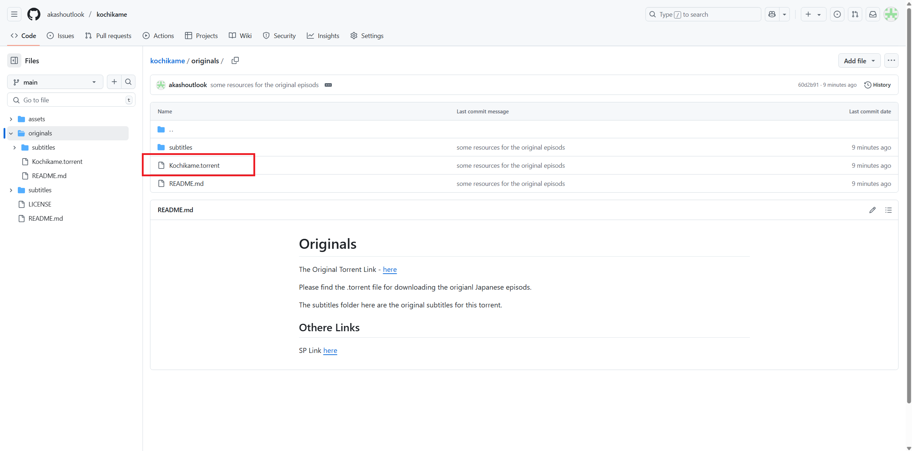
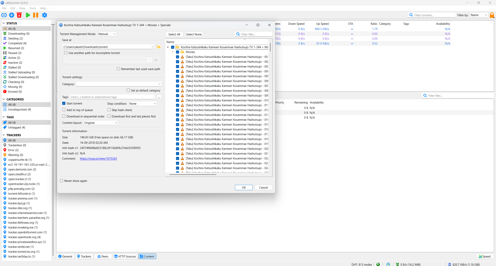
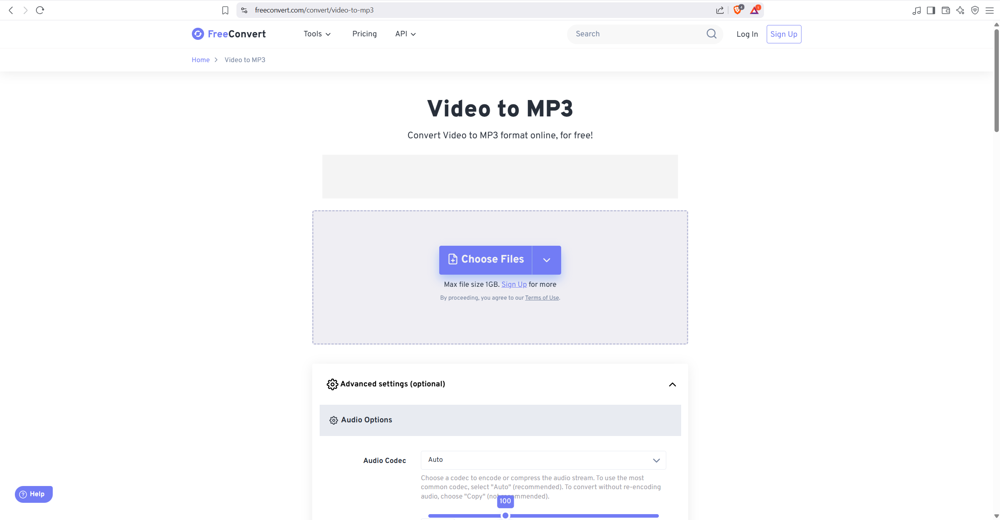
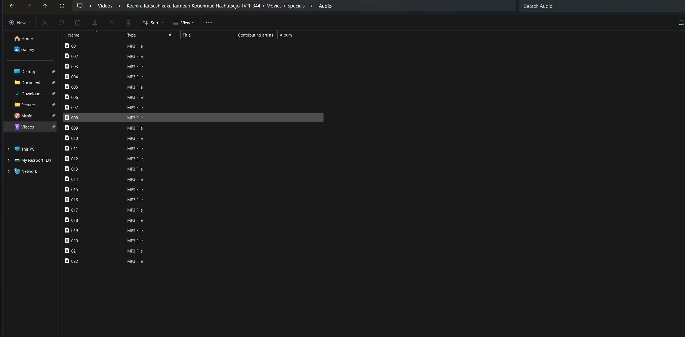
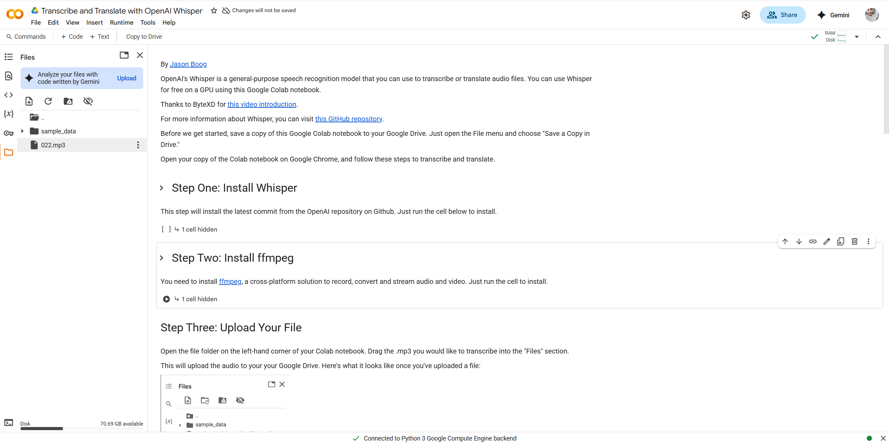

# How to generate subtitle for the original episode?

Please follow the below steps to generate the subtitles.

1. From the originals folder take the torrent file and download the episode.
   
   
2. Once the episode is downloaded, we need to extract the audio form that. For this we can use this website [here](https://www.freeconvert.com/convert/video-to-mp3).
   
   
3. Once you have extracted the raw Japanese audio, we need to transcribe and translate it. For this we will use OpenAI Whisper.
4. Go to this Google Colab file [here](https://colab.research.google.com/drive/1WLYoBvA3YNKQ0X2lC9udUOmjK7rZgAwr?usp=sharing)
5. Upload the audio mp3 file in the files section
   
6. Now execute the "Step One: Install Whisper"
7. Then execute the "Step Two: Install ffmpeg"
8. Skp the "Step Three: Upload Your File", as we have already uploaded the mp3 file.
9. In the step Four, please replace the command like below

   ```sh
   !whisper "022.mp3" --model medium --language Japanese --task translate
   ```

   Here we need to give the actual mp3 file name what we have uploaded.

10. Then wait, the AI will automatically stanscribe and translate into English with timestamp. It will take around 5 to 8 min.
11. Once done, copy the content in a .txt file with name "`Eng_raw.txt`".
12. Then in the same folder, where you have this .txt tile, execute the python script, `srt_converter.py`.
13. It will generate the proper srt file named, `Eng_proper.srt` for VLC.
14. Rename the .srt file as you wish and use it.
15. Enjoy.
